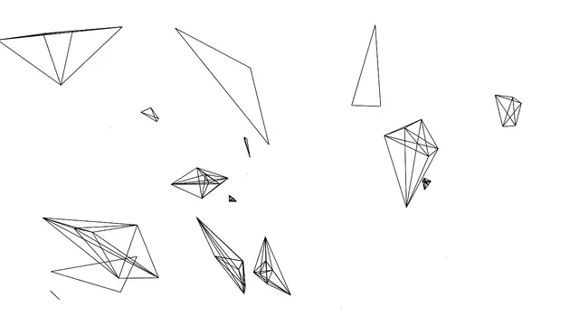

# Content
Contains the creative stuff I have written while reading Nature of Code by Daniel Shiffman

All the code has been written in Processing 2.2.1 (If not stated otherwise.)

## Repo structure

Each folder contains a single example that can be executed from the `.pde` file with the same name as the folder.

Each folder also contains a README.md that shows an animation of the output of the code.

## Examples
### RandomWalkingConnectome

